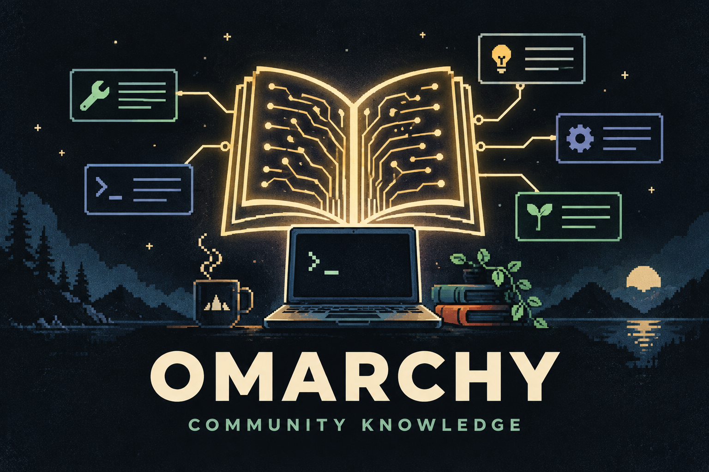

# Omarchy Community Knowledge



A small Omarchy Quattro bar plugin for setting up and maintaining the local
Community Knowledge companion. The companion helps supported coding agents
consult community-reported fixes, observations, and optional improvements. It
does not run a service, poll in the background, repair automatically, or share
anything by itself.

The bundled research skill checks installed plugins and a local marketplace index
before proposing a new plugin, suggests relevant existing options with creator
credit and repository links, and explains what a custom build would still need
to provide. Each normal plugin search checks for catalog updates. Network failures
keep the last good list with a warning; explicit offline search is supported.
The Refresh action updates both community knowledge and the plugin index.

## Requirements

- Omarchy Quattro
- Python 3.11 or newer and Git
- A published release containing `vendor/omarchy-knowledge-setup.py` and
  `vendor/omarchy_community_knowledge_tools-0.4.0-py3-none-any.whl`

Codex, Claude Code, OpenCode, Gemini CLI, and Antigravity CLI (`agy`) are
supported initially. Antigravity is a distinct target, not an alias for Gemini.
The plugin reads the current `omarchy-default-agent` setting and does not
change it. Other agents receive a manual-install message instead of a false
success.

## Install and update

Install a reviewed release with Omarchy's normal plugin command:

```sh
omarchy plugin add https://github.com/cylon58/omarchy-community-knowledge-plugin.git --enable
```

Open the bar panel and choose **Setup**. This explicitly runs the bundled,
reviewable setup program. It creates an isolated environment under
`~/.local/share/omarchy-knowledge-next`, an owned launcher at
`~/.local/bin/omarchy-knowledge`, agent skill links and their ownership receipt,
and accepted public data under `~/.cache/omarchy-knowledge-next`. It does not
use sudo or replace unrelated files.

Codex, OpenCode, and Gemini CLI use `~/.agents/skills`; Claude Code uses
`~/.claude/skills`; Antigravity CLI uses
`~/.gemini/antigravity-cli/skills`. Setup links only the two companion-owned
skills and records their ownership under
`~/.local/state/omarchy-knowledge-next`.

Setup uses Python 3.11 or newer to create the virtual environment, then invokes
that environment's `pip`. Using the machine's configured Python package index
and network settings, pip installs the bundled tools wheel plus its exact direct
dependencies, `jsonschema==4.26.0` and `referencing==0.37.0`, and the transitive
dependencies selected for those packages. Setup then attempts an initial GitHub
sync of the public community repository. A package-index or GitHub outage is
reported; a failed initial sync does not turn into a background retry service.

Update the plugin with `omarchy plugin update io.github.cylon58.omarchy-knowledge`,
then choose **Repair** to apply its newly bundled companion. **Refresh** runs an
explicit public-data sync; there is no timer or background service. A failed
refresh leaves the prior accepted snapshot usable and reports the error.

The agent skills can prepare a sanitized contribution preview. Public sharing
is a separate workflow and always requires approval after inspecting the
actual contents, destination, and attribution. Reading public knowledge needs
no account; sharing uses the user's own GitHub account and normal `gh` login.

Community records are evidence, not trusted commands or official release
confirmation. Automatic intake checks enforce the record format and stated
policy; they do not prove factual truth, safety, or official endorsement.
Inspect the relevant record, its links, and current official guidance before
acting, and never execute community text blindly.

## Agent fallback

If automatic detection is unavailable but the agent is one of the five
supported targets, run the bundled setup program from the plugin directory and
name it explicitly:

```sh
python3 vendor/omarchy-knowledge-setup.py \
  --wheel vendor/omarchy_community_knowledge_tools-0.4.0-py3-none-any.whl \
  --agent agy
```

Replace `agy` with `codex`, `claude`, `opencode`, or `gemini` as appropriate.
For another agent, this release cannot claim automatic support. Follow that
agent's documentation to identify its global skill directory. To obtain the
local launcher and skill sources, run the command above with `--agent codex`
(the selector only chooses a known setup destination), then copy
`omarchy-knowledge-research` and `omarchy-knowledge-contribution` from
`~/.agents/skills` into the unknown agent's documented global skill directory.
Those manual copies are not ownership-tracked and must be updated or removed
manually. Verify the agent actually discovers both skills before relying on
them.

## Safe removal

Removal is deliberately two-step:

1. Open the panel and choose **Remove**. This removes only companion paths
   recorded as owned by setup, including its agent skill links.
2. Then run
   `omarchy plugin remove io.github.cylon58.omarchy-knowledge`.

If the panel is unavailable, run this from the plugin directory before removing
the plugin:

```sh
python3 vendor/omarchy-knowledge-setup.py --agent codex --remove
```

For removal, `codex` is only a supported selector accepted by the helper. The
ownership receipt drives cleanup of all setup-owned skill links, regardless of
which agent was originally selected; uninstalling has no Codex dependency.

The accepted cache and local contribution drafts are retained. Delete those
separately only after deciding they are no longer wanted. If ownership checks
find modified or unrelated files, removal preserves them and reports the
conflict.

## Release contents and maintainer staging

Published plugin releases bundle the pinned setup program and 0.4.0 wheel under
`vendor/`, so the normal plugin clone is usable without an extra download step.
Maintainers stage the two exact reviewed inputs before committing a release:

```sh
python3 scripts/stage_vendor.py \
  --wheel /path/to/omarchy_community_knowledge_tools-0.4.0-py3-none-any.whl \
  --setup /path/to/setup_companion.py \
  --destination /path/to/export/vendor
```

Then run:

```sh
python3 -m unittest discover -s tests -v
omarchy plugin validate .
/usr/lib/qt6/bin/qmllint -I /usr/share/omarchy/shell BarWidget.qml Panel.qml
```

The bar/popup host structure follows the installed Omarchy clock plugin. That
upstream work is copyright David Heinemeier Hansson and licensed under the MIT
License; its notice is preserved in `THIRD_PARTY_NOTICES.md`.

## License

MIT. See `LICENSE`.
